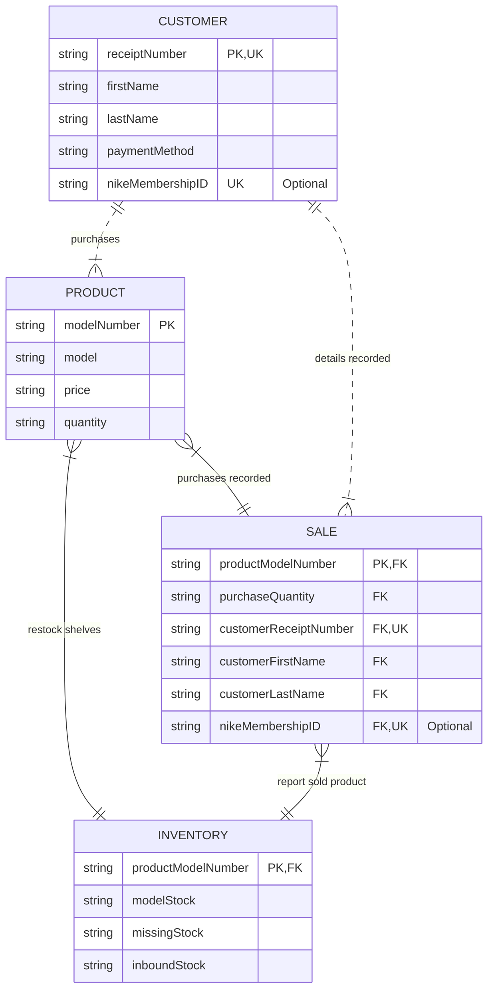

# Nike Store Element Relationships

#### The Four Elements
* Product: The specific shoes models being sold at the Nike store.
* Customer: The individuals that purchase shoes and identifiying details.
* Sale: Transaction record for purchases.
* Inventory: Represents the quantity of remaining product for each model of shoe.

#### Relationships
* The Product and Customer relationship connects buyers to the specific models of shoes bought. If customers don't purchase product, there is no business.
* The Product and Sale relationship covers the documentation of what shoes are being bought and in what quantity. It is important in business to accurately charge for sold product and take note of what is sold.
* The Customer and Sale relationship records the information of who is buying the product. It is important to know what customer bought what product for multiple reasons: processing returns, tallying buying customers,  measuring the average quantity of product individual customers bought, and tracking of membership bonuses.
* The Sale and Inventory relationship keeps track of how many shoes need to be reordered due to sold product. Without sale tracking the store will either overbuy, cramping inventory, or underbuy, run out of product to sell.
* The Inventory and Product relationship ensures there is product available to be sold. It is important for there to be spare product available should store shelves be emptied of a specific product.

